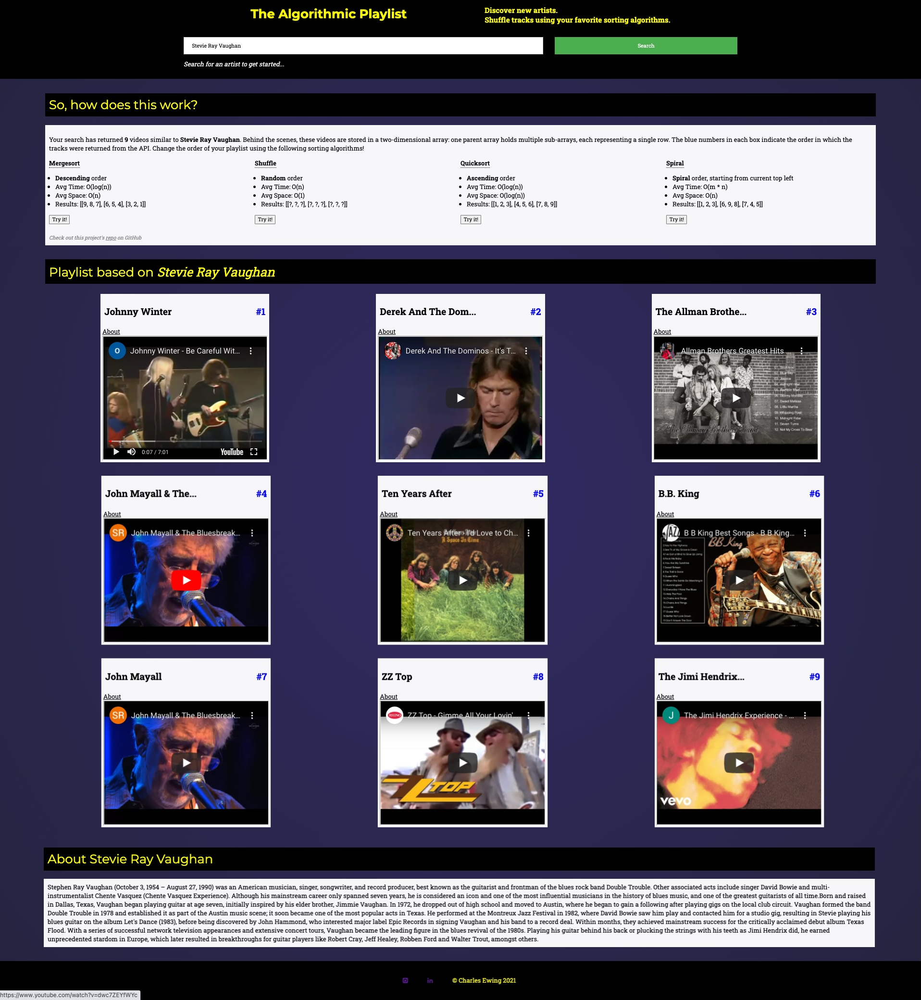

# Algorithmic Playlist

*Algorithmic Playlist* generates playlists of songs by similar musical artists and changes track order using common sorting algorithms.

* [Screenshot](#screenshot)
* [Technologies](#technologies-used)
* [Set-Up Repo on Local Machine](#set-up-repo-on-local-machine)

# Screenshot

  
# Technologies Used
### API
[Taste Dive API](https://tastedive.com/read/api)
### Front-End Development
JavaScript 
 

React 
 

Axios 
 

### Back-End Development
Node.js 
 

Express.js 
 

### Compiler
Webpack 
 

Babel 
 

### Styling
CSS 
 
 

# Set-Up Repo on Local Machine
* `git clone https://github.com/charlesewing3/algoplaylist.git`
* `npm install` to install dependencies
* `npm run react-dev` to run the pre-configured webpack
* `npm start` to run the server
